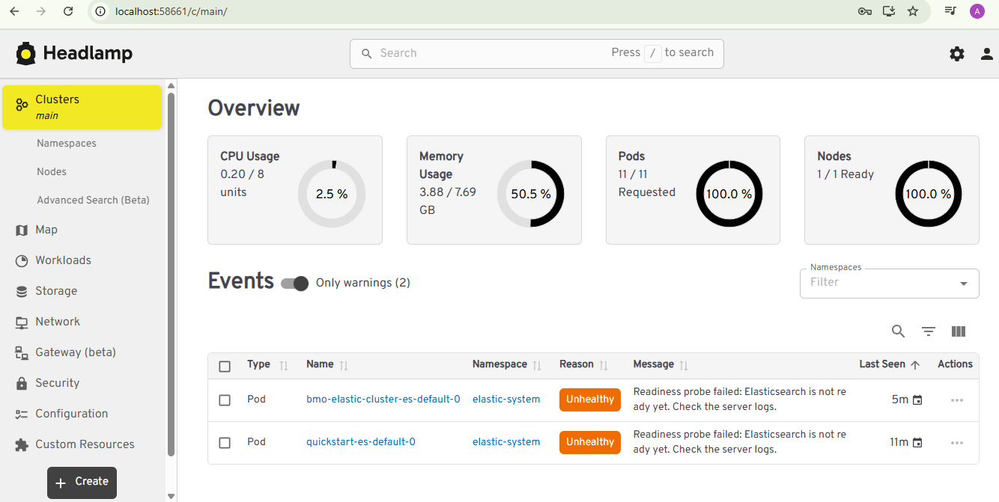

**HEADLAMP K8 UI**

Headlamp is an open-source web-based UI for managing Kubernetes clusters. It provides developers with a convenient interface to quickly view and interact with cluster resources, eliminating the need to manually access the cluster via CLI.

Headlamp simplifies common operational tasks such as viewing logs, inspecting workloads, and monitoring resource status. Its intuitive dashboard helps streamline development workflows and boosts productivity in day-to-day Kubernetes usage.

