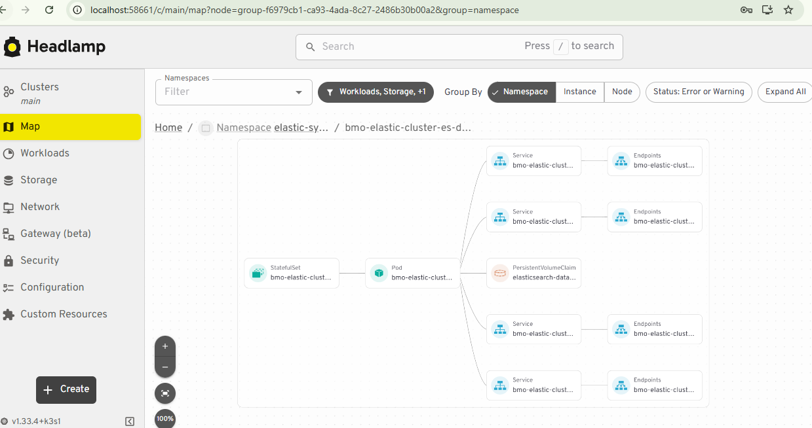
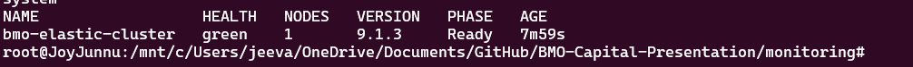
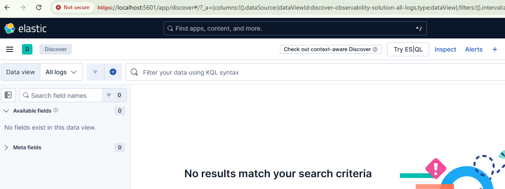

**Elastic & KIBANA using ECK Operator**

Leverage the ECK Operator to deploy an Elasticsearch cluster and Kibana, either cluster-wide or within a specific namespace.

Watchers will be implemented according to project requirements. Dashboards, synthetic monitoring, and SLO/Error Budgets will be set up to ensure comprehensive

**Steps:**
kubectl create -f eck-operator-crds.yaml
kubectl apply -f eck-operator.yaml

kubectl apply -f elastic-cluster.yaml
kubectl apply -f eck-operator-cm.yaml

kubectl apply -f kibana.yaml

After Few Minutes check:

kubectl get elasticsearch -n elastic-system
kubectl get pods --selector='elasticsearch.k8s.elastic.co/cluster-name=quickstart'

-------------

